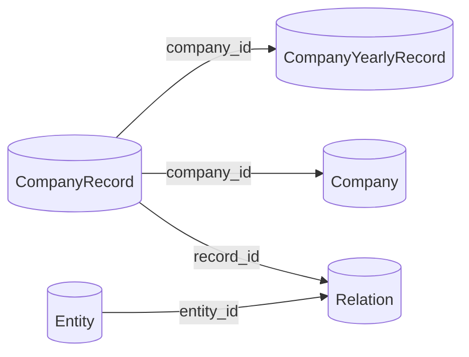
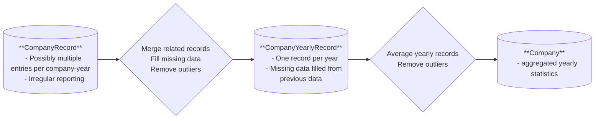
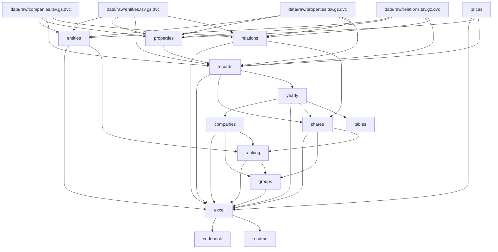

# ``KINGPOL_INDUSTRY``: Industry and bourgeoisie in Kingdom of Poland, 1904-1911

> [!NOTE]
> Access online version [here](https://github.com/iss-obuz/kingpol/blob/master/README.md)

This repository contains code and auxiliary files as well as instructions
for obtaining the raw data necessary for reproducing the ``KINGPOL_INDUSTRY`` database.
The database describes industry and bourgeoisie of the Kingdom of Poland in years 1904-1911
at the finely-grained level of individual companies as well as physical and legal persons
associated with them.

The data was derived from “Address Book of Factory Industry in the
Kingdom of Poland” (Polish: “Księga adresowa przemysłu fabrycznego w
Królestwie Polskiem“). The address book was a private venture coordinated
and edited by Leon Jeziorański. However, they were published under the
patronage of the “Association of Technicians in Warsaw”, which was one of
the Polish NGOs which, like a number of other similar associations,
was a substitute for the institutions of the then non-existent Polish
nation state in that period. The address book was published eight times:
in 1904, 1905, 1906, 1907, 1908, 1910, and twice in 1911. Each edition
contained a list of companies in the Kingdom, divided by industry and, at
a lower level, by region (gubernia in Polish or governorate in English).
Depending on the size of the company and the will of its management
(reporting was voluntary due to the private nature of the enterprise)
more or less data on individual companies was included, ranging from the
company’s address, name and the industry, to employment and either
financial value of production (measured in Russian rubles) or the volume
of the material output, which subsequently was converted to its
corresponding financial value. Moreover, for cases with both employment
and output value information available it was possible to calculate
productivity. Importantly, reported data also included information
(at various levels of detail) on owner(s) (both physical and legal
persons), president(s), board members, and other associates.
This, in turn, allowed for aggregation of main numerical indicators
such as employment or production value, and in principle allows for
reconstruction of bipartite (two-mode) networks of relations between
individual entities (physical or legal persons) and companies and,
as a result, identification of clusters of similarly networked individuals
and business entities.

The repository allows not only for reproducing the dataset in its
"official" form compiled for the
[journal publication](#journal-publication), but also for
[re-compiling under different assumptions](#dataset-compilation).

## Journal publication

For a detailed scholarly discussion of the dataset and its socio-historical
background see the following publication:

> TODO

**IMPORTANT.**
The publication corresponds to version `v1` of the database,
which is archived and available at a dedicated
[`v1` branch](https://github.com/iss-obuz/kingpol/tree/v1),
which is also marked with `v1` tag.
To clone this exact version of the repository, use the following command:

```{bash}
git clone --branch v1 git@github.com:iss-obuz/kingpol.git
```

## Contact & data access

Main software developer:

* Szymon Talaga, `<stalaga@uw.edu.pl>`

Academic project leaders and other contributors are listed in the
[journal publication](#journal-publication).

### Reporting errors

While reporting errors via email is possible, it is highly recommended to use the
[issue tracker](https://github.com/iss-obuz/kingpol/issues) of the repository.
This allows for better tracking of the issues and their resolution.
Moreover, it allows for other users to see the issues and their resolution,
which may be helpful for them as well.

## Definitions

The dataset semantics are based on the following important definitions:

- **Address Book.** Refers to “Address Book of Factory Industry in the
  Kingdom of Poland” (Polish: “Księga adresowa przemysłu fabrycznego w
  Królestwie Polskiem“) as such or to a specific edition (volume)
  of the address book depending on the context.

- **Volume.** Specific edition of the Address Book.

- **Company.** A specific company or business entity engaged in production
  of a specific category of products or services, which has been listed
  separately in the Address Book. In most cases it corresponds to a
  production facility with a specific physical location,
  i.e. not a conglomerate of multiple companies, but due to the somewhat
  informal nature of the Address Book the definition is not strict
  and the category of companies may include some compound entities.

  > [!IMPORTANT]
  > Companies are identified by a unique identifier: `company_id`.

- **Record.** A single entry in the Address Book reporting information on
  a specific company for a given volume of the Address Book.

  > [!IMPORTANT]
  > Records are identified by a unique identifier: `record_id`. Moreover, each record has a stable `company_id` allowing for joining with other tables.


- **Yearly record.** A record aggregated over all records associated with
  the same company within the same year. Yearly records are obtained by
  aggregating all simple records associated with the same company within
  the same year. They are created for all years for which the dataset
  was compiled with missing years filled by filling forward from the
  latest available yearly record. Years before the first record are
  backfilled from the first available record for companies with known
  foundation year.

  > [!IMPORTANT]
  > Yearly records are identified by a unique combination of fields `company_id` and `year`.

- **Entity.** A physical or legal person. Legal persons are typically
  joint-stock companies or other forms of business partnerships.

  > [!IMPORTANT]
  > Entities are identified by a unique identifier: `entity_id`.

- **Relation.** A relationship between an entity and a company
  as reported in a given volume of the Address Book.
  Relationships have types such as "owner", "president" or "board member".
  This information is used for estimating production value and/or
  employment that is likely to be under at least partial control
  of specific entities.

  > [!IMPORTANT]
  > Relations are identified by a unique combination of `entity_id` and `record_id`. This allows for joining entities with company information from other tables.

- **Ranking.** A ranking of entities based on their production value and/or
  employment. The ranking is obtained by aggregating production value
  and/or employment of all associated companies.

  > [!IMPORTANT]
  > Entities in the ranking are identified by a unique identifier: `entity_id`.

- **Product.** A category of products produces by a given company.

- **Unit.** A unit of measurement for a given product.

- **Price.** A price (in Russian rubles) for a given quantity of a given
  product in a specific year. Together with product and unit information
  it allows for converting the raw output of a company to the financial
  value of production.

## Tables & schemas

The detailed list of tables included in the ``KINGPOL_INDUSTRY`` database
as well as their schemas are available in the [CODEBOOK](CODEBOOK.md).

All tables are available both as individual tables
in the format of [Apache Parquet](https://parquet.apache.org/) files,
or as separate sheets in the main Excel workbook:
`data/proc/kingpol.xlsx`.

### Main tables

* **Companies (yearly).** Yearly records are obtained by aggregating all simple records associated with
the same company within the same year.

* **Companies.** Company information and statistics aggregated over yearly records.

* **Ranking.** Entity ranking table contains main entity identifiers and metadata
together with production value and employment corresponding to the given entity
by aggregating value and employment of associated companies.

## Technical & methodological details

The rest of this document is focused on technical and methodological
details of the construction and structure of the dataset.

### Structure of the dataset

The dataset forms a relational database consisting of several tables linked
to each other. Most tables contain information related either to companies
or entities and individual records are identified by unique identifiers
(primarily: `company_id`, `record_id` and `entity_id`). This allows for
joining tables and answering complex queries.

In particular, the following relational joins are possible:



### Overview of the construction of company statistics

The following diagram illustrates the main steps in the (re)construction
of the company from Address Book records.



### Dataset compilation

Compilation of the dataset is a multistep process consisting of several stages,
where each stage is responsible for generating and validating specific table(s)
and may depend on the output of previous stage(s). The execution of the compilation
pipeline is controlled by the [DVC](https://dvc.org/) tool which allows for
tracking the dependencies between individual stages and tables, as well as executing
only necessary stages of the pipeline in a reproducible manner. The compilation
stages are defined in the [`dvc.yaml`](dvc.yaml) file and the dependencies
between them are visualized in the diagram below. The root nodes of the diagram
(with `.dvc` suffix) are the raw input files for the pipeline, while all other nodes
correspond to individual stages (two last stages are responsible for generating
[README](README.md) and [CODEBOOK](CODEBOOK.md) files).



#### Compilation parameters

The compilation process is controlled by a set of parameters defined in the
[`params.yaml`](params.yaml) file. The parameters are used to control
the behavior of individual stages of the pipeline and allow for
recompiling the dataset with different assumptions.
Specifics of how different parameters affects particular tables
are discussed in the [CODEBOOK](CODEBOOK.md).

In particular, `years` parameter list can be used to control the years included
when aggregating yearly records for the `Company` and `EntityRanking` tables.

**IMPORTANT.**
When compiling for a subset of years or some other non-standard selection parameters,
turn of testing by setting `test: false` in the `params.yaml` file, or compiling
with environment variable `KINGPOL_TEST=false`. See [developer notes](#developer-notes)
for more details. **Currently**, the dataset is configured to be compiled for 1911 only,
which corresponds to the version used in the
[journal publication](#journal-publication), so the `test` parameter is set to `false`.
In order to compile for all years, set `test: true` and
`years: [1904, 1905, 1906, 1907, 1908, 1910, 1911]`
(the full selection is commented out in [params.yaml](params.yaml)).

### MD5 checksums

Below is the list of MD5 checksums for the raw and auxiliary data files needed for compiling the database.
The checksums are read from the [dvc.lock](dvc.lock) file.

* Raw data files

	* `data/raw/companies.tsv.gz`: `16934d114f464e9df6fcac528c817425`

	* `data/raw/properties.tsv.gz`: `4030b19ac71dc5c2596210c4a42264be`

	* `data/raw/entities.tsv.gz`: `eb43bf3ffa1fb9c85c0db07dac977d12`

	* `data/raw/relations.tsv.gz`: `73e24e405500713b86940047d58368c7`

* Auxiliary data files

	* `data/aux/prices.xlsx`: `ed72692acae68ab4a715d737b317df8f`

	* `data/aux/corrections.xlsx`: `2b5b1ea7afbe6c32dca33ffe727e0faf`

	* `data/aux/properties.xlsx`: `99d75b68d61e71ee359450418018b894`

	* `data/aux/merging.xlsx`: `701bd227a57366efdd26c0f750700156`

### Outlier detection

An important part of the dataset compilation process is outlier detection
and removal. This is necessary due to the self-reported and somewhat
informal nature of the Address Book, in which there are,
relatively rare but existent, inconsistencies in how employment and
production value are reported. This results in unrealistically high or low
values of productivity for some records. Thus, for the sake of accuracy
of any downstream calculations, such records are marked and removed
from later compilation stages. The exact process is as follows.

* Each company record is marked as either a valid record or outlier
  based on the relationship between its productivity and the average
  productivity of its respective industry. This procedure uses
  a custom outlier detection algorithm based on the idea that
  the spread of productivity values in a given industry cannot be
  too large. The algorithm is described
  [here](#outlier-detection-algorithm).
* Outlier records are not removed from the `CompanyRecords` table.
* However, they are removed from the `CompanyYearly` table, which
  affects all downstream tables (in particular `Company`).

> [!NOTE]
> Only records with both employment and production value are considered in outlier analysis. Other records are automatically included.

Subsequently, the outlier detection and removal procedure is applied
also to `CompanyYearly` and `Company` tables. However, in these cases
records considered outliers are not included in the tables at all.

#### Outlier detection algorithm

The algorithm is based on the idea that the spread of productivity values
in a given industry cannot be too large. The algorithm works as follows:

1. For each industry, calculate the average productivity.
2. To each record, assign a variable `outlier_score = 0`.
3. For each record, calculate the ratio of its productivity to the average
   productivity of its industry in the base 10 logarithmic scale.
   For records with values outside the range $\pm \lambda$ around
   the industry average increment the `outlier_score` variable by ``1``.
   * $\lambda$ is a parameter defined in the [params.yaml](params.yaml)
   file separately for each stage implementing outlier detection.
   The default value is ``0.5``, which corresponds to the assumption
   that the spread of productivity should be confined within one
   order of magnitude.
4. If any records has been outsider the range, repeat steps 1-3.
5. Finally, records with `outlier_score > 0` are considered outliers.

### Developer notes

Currently, no detailed additional developer notes are available.
Interested developers are encouraged to contact the authors of the dataset
and/or study the code in the repository, most of which should be
quite self-explanatory for Python developers. Below only a very brief overview is
provided.

#### Setting up the environment

We recommend using [Conda package manager](https://anaconda.org/anaconda/conda) for setting up the environment.
We will use it in what follows.

First, use [GIT](https://git-scm.com/) to clone the repository,
and navigate to the root directory of the repository:

```{bash}
git clone git@github.com:iss-obuz/kingpol.git
cd kingpol
```

Then, create and activate a new environment with the following commands:

```{bash}
conda env create -f environment.yml
conda activate kingpol
```

Install the local `kingpol` package, its dependencies and configure DVC.
This is a somewhat complex process, so a helper `make` command is provided
(and defined in `Makefile`) to do this automatically.

```{bash}
make init
```

Now, the structure of the DVC pipeline can be inspected with:

```{bash}
dvc stage list

# OR

dvc dag
```

#### Compiling the dataset

The dataset can be compiled with the following command:

```{bash}
dvc repro
```

An individual stage can be run with:

```{bash}
dvc repro <stage_name>
```

where `<stage_name>` is the name of the stage to be run.
Learn more about DVC [here](https://dvc.org/doc/start).

This will compile the dataset with the default parameters defined in
[params.yaml](params.yaml) file. To run the pipeline without running tests
(this is often necessary when compiling with changed parameters)
set the `test` parameter to `false` in the `params.yaml` file
or run the pipeline with the following command:

```{bash}
dvc repro --set-param test=false
```

Alternatively, the `KINGPOL_TEST` environment variable can be set to `false`
when running the pipeline:

```{bash}
export KINGPOL_TEST=false dvc repro
```

But note that this disables testing for all subsequent DVC runs within the same
shell session.
